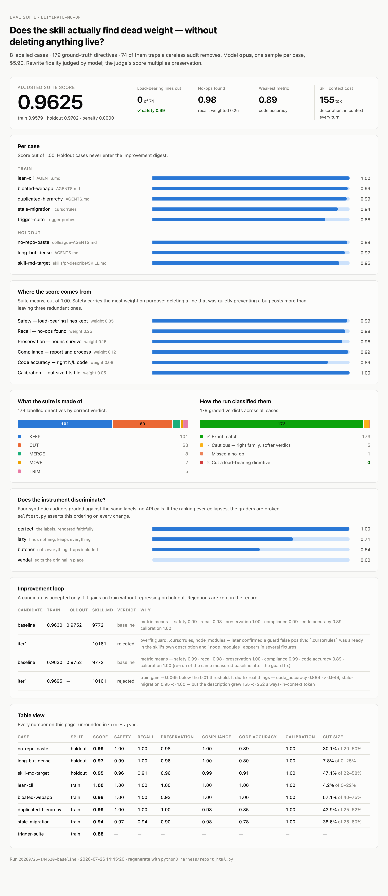

# Skills

Agent skills for real engineering work.

These skills are small, easy to adapt, and composable. They work with any model. Hack around
with them, make them your own.

## Install

With the [skills.sh](https://skills.sh) installer:

```bash
npx skills@latest add pat-lewczuk/skills
```

Or copy the directory you want straight into your project:

```bash
cp -r skills/eliminate-no-op /path/to/your-project/.claude/skills/
```

## Skills

### eliminate-no-op

Audits agent instruction files — `AGENTS.md`, `CLAUDE.md`, `SKILL.md`, `.cursorrules`, system
prompts — for directives that burn context without changing behavior.

Instruction files rot. Every incident adds a rule, no one ever removes one, and the file drifts
into a wall of well-meant text the model already agreed with. That text occupies context on
every turn and dilutes attention away from the rules that actually encode project knowledge.

The skill runs a mechanical pass (duplicate detection, dead path references, token cost per
section), then classifies every directive as `KEEP` / `TRIM` / `MERGE` / `MOVE` / `CUT` against
five survival tests. It produces a findings report and writes the rewrite *beside* the original
— never in place — so you review a diff before anything is applied.

It is deliberately conservative: deleting a line that was quietly preventing a recurring bug
costs far more than leaving three redundant lines alone.

## Evals

`evals/eliminate-no-op/` holds the eval suite for that skill: eight labelled cases, weighted
metrics that punish deleting a load-bearing line three times harder than missing a platitude,
and a loop that revises the skill from its own failures and keeps a revision only if it holds
up on cases it was never tuned against.

<picture>
  <source media="(prefers-color-scheme: dark)" srcset="evals/eliminate-no-op/docs/results-dark.png">
  
</picture>

```bash
cd evals/eliminate-no-op
python3 harness/selftest.py     # validate the graders, free
python3 harness/run.py          # run the suite
python3 harness/loop.py --iterations 2
python3 harness/report_html.py  # regenerate results.html + the image above
```

Details, case-by-case, in [`evals/eliminate-no-op/README.md`](./evals/eliminate-no-op/README.md).

## License

[MIT](./LICENSE)
